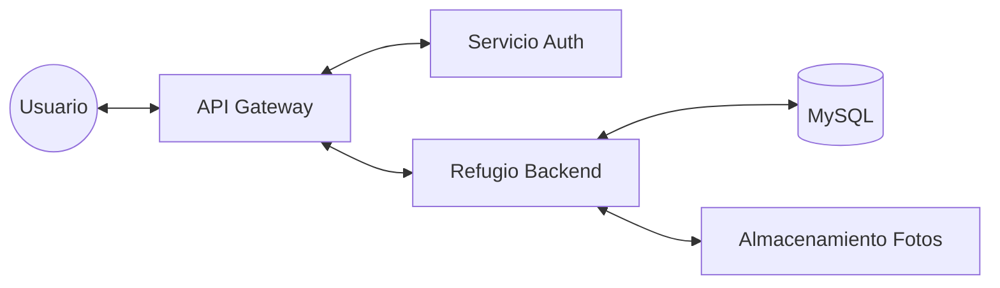

# 🏗️ Arquitectura y Componentes del Sistema
---

El **Sistema de Gestión del Refugio** está diseñado bajo una **Arquitectura de Microservicios** distribuida, utilizando el ecosistema de **Spring Cloud**. Cada módulo es independiente, escalable y se comunica a través de una red interna protegida.

## 🗺️ Mapa Visual de la Arquitectura

A continuación se presenta un diagrama de alto nivel que muestra la interacción entre los diferentes componentes del ecosistema:

## 🌩️ Infraestructura de Microservicios

El sistema se apoya en tres componentes críticos de infraestructura que orquestan el tráfico y la seguridad:

1.  **Eureka Server (Discovery Service):** Actúa como las "páginas amarillas" del sistema. Cada microservicio se registra aquí para que los demás puedan localizarlo sin conocer su IP exacta.
2.  **API Gateway:** Es la puerta de entrada única para el Frontend. Se encarga del enrutamiento inteligente de peticiones hacia los microservicios correspondientes y aplica filtros de seguridad iniciales.
3.  **Auth Service (Seguridad):** Microservicio dedicado exclusivamente a la gestión de usuarios, roles y generación de tokens **JWT**. Centraliza la seguridad para evitar duplicidad de lógica.
4.  **Backend Service (`refugio-backend`):** Es el corazón funcional del sistema. Procesa toda la lógica de negocio relacionada con los animales, las adopciones, el historial médico y las tareas de los voluntarios. Se comunica con su propia base de datos MySQL de forma aislada.
5.  **Frontend Service (`refugio-frontend`):** Microservicio encargado de la interfaz de usuario. Utiliza Thymeleaf y Spring Boot para servir las páginas web, consumiendo los datos del backend exclusivamente a través del Gateway.
6.  **Common Module (`refugio-common`):** No es un servicio ejecutable, sino una librería compartida que contiene la lógica transversal (identificadores, excepciones genéricas y contratos de repositorios) que usan todos los microservicios para mantener la coherencia.
7.  **Persistencia (Bases de Datos MySQL):** El sistema utiliza contenedores Docker con MySQL. Siguiendo las buenas prácticas de microservicios, cada servicio gestiona su propio esquema de datos de forma aislada, garantizando la independencia y seguridad de la información.

---

## 🛠️ Capas del Microservicio (Clean Architecture)

Dentro de cada microservicio de negocio (como `refugio-backend`), seguimos los principios de **Arquitectura Hexagonal/Clean** para garantizar que el código sea mantenible y testable:

### 1. Capa de Dominio (Domain)
El corazón del sistema. Aquí residen las entidades y reglas de negocio puras, sin dependencias de frameworks.
*   **Entidades:** `Animal`, `Adoptante`, `Voluntario`, `SolicitudAdopcion`, `Adopcion`, `Tarea`, `HistorialMedico`, `Donacion`, `Notificacion`, `Logro`, `UsuarioLogro`, `UsuarioMetricas`, `ObjetivoDonacion`, `FavoritoAnimal`, `TareaHistorial`.
*   **Repositorios (Interfaces):** Definen cómo se accede a los datos sin decir "cómo" se guardan.
*   **Excepciones de Dominio:** Errores específicos del refugio (ej: `AnimalYaAdoptadoException`).

### 2. Capa de Aplicación (Application)
Orquesta los casos de uso. Es el puente entre el mundo exterior y el dominio.
*   **Use Cases:** Clases que ejecutan una acción concreta (ej: `AprobarSolicitudAdopcionUseCase`).
*   **Mappers:** Transforman los datos entre la capa externa y el dominio.

### 3. Capa de Infraestructura (Infrastructure)
Contiene los detalles técnicos y adaptadores externos.
*   **Persistence (JPA):** Implementaciones reales para la base de datos MySQL.
*   **Web Controllers:** Exposición de la API REST para ser consumida por el Gateway.
*   **Servicios Externos:** Integración con sistemas de notificaciones o pasarelas de pago.

---

## 📦 Componentes Compartidos (Common)

Para evitar repetir código, utilizamos un módulo **Common** que se inyecta como dependencia en todos los microservicios:
*   **Generic CRUD:** Abstracciones para operaciones básicas de base de datos.
*   **DTOs Base:** Estructuras de datos comunes para la comunicación entre servicios.
*   **Manejo Global de Errores:** Estandarización de las respuestas de error en toda la red.
*   **`ExcelExportHelper` (Utilidad de Exportación):** Clase genérica (`<T>`) basada en **Apache POI** que genera archivos `.xlsx` en memoria sin depender del `Servlet API`. Es consumida por los 9 controladores del `refugio-frontend` para exportar cualquier listado maestro sin duplicar lógica.
*   **`PaginatedResponse<T>` (Paginación):** DTO genérico centralizado que sirve los datos gradualmente bajo demanda, aliviando la carga de RAM del servidor y el ancho de banda.

---

## 🖥️ Frontend (Capa de Presentación)

Desarrollado como un microservicio independiente que consume la API a través del Gateway.
*   **Tecnología:** Spring Boot con Thymeleaf para el renderizado del lado del servidor.
*   **Comunicación (HTMX):** Las interacciones del usuario (búsquedas, paginación, modales, apertura de calendarios) se gestionan asíncronamente mediante **HTMX** (`hx-get`, `hx-post`). Esto permite actualizar "Fragmentos de HTML" parciales sin recargar la página completa, consiguiendo un comportamiento Single Page Application (SPA) pero sin la complejidad de React/Angular.
*   **Exportación de Reportes (PDF/Excel):** La lógica de exportación documental se ha delegado a los controladores de presentación (ej. `AnimalViewController`, `TareaViewController`) utilizando **iTextRenderer** y **Apache POI**. Esta decisión arquitectónica mantiene el backend puro y libre de librerías de generación de vistas o documentos pesados.
*   **Consumo de API:** Realiza llamadas REST al Gateway usando la librería `RestClient` compartida, manteniendo la interfaz desacoplada de la lógica de negocio.

---

[⬅️ Volver al README](/README.md)

