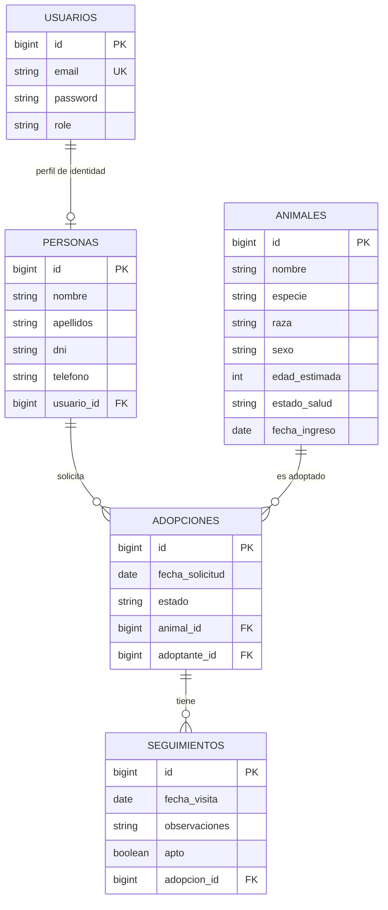

### Base de Datos - Sistema de Gestión del Refugio
---

La capa de persistencia del **Refugio de Animales** ha sido diseñada bajo el principio de **abstracción de almacenamiento**, asegurando que la lógica de negocio (gestión de animales y adopciones) sea independiente del motor de base de datos. Se utiliza **Spring Data JPA** y **Hibernate** para garantizar esta agnosia tecnológica.

---

#### 1. Estrategia de Desarrollo: H2 Database

Para las fases de desarrollo local, prototipado y pruebas automatizadas, se utiliza **H2**, permitiendo un ciclo de desarrollo ágil y sin dependencias externas.

##### Configuración del Entorno (Profile: `dev`)

```properties
# --- H2 Configuration (application-dev.properties) ---
spring.datasource.url=jdbc:h2:mem:refugio_db;DB_CLOSE_DELAY=-1
spring.datasource.driverClassName=org.h2.Driver
spring.datasource.username=sa
spring.datasource.password=

# --- JPA & Hibernate ---
spring.jpa.hibernate.ddl-auto=none
spring.jpa.database-platform=org.hibernate.dialect.H2Dialect
spring.jpa.show-sql=true
```

---

#### 2. Modelo de Datos (Diagrama E-R)

El siguiente diagrama representa la estructura relacional para la gestión del refugio, centrada en los animales y sus procesos asociados.



---

#### 3. Estrategia de Producción: MySQL

Para el entorno de producción y aprovechando la contenerización con Docker, se empleará **MySQL**, garantizando la robustez y persistencia de los datos históricos del refugio.

##### Configuración de Producción (Profile: `prod`)

```properties
# --- MySQL Configuration (application-prod.properties) ---
spring.datasource.url=jdbc:mysql://db:3306/refugio_db
spring.datasource.username=root
spring.datasource.password=root

spring.jpa.database-platform=org.hibernate.dialect.MySQLDialect
spring.jpa.hibernate.ddl-auto=validate
```

---

[Volver](/README.md)
