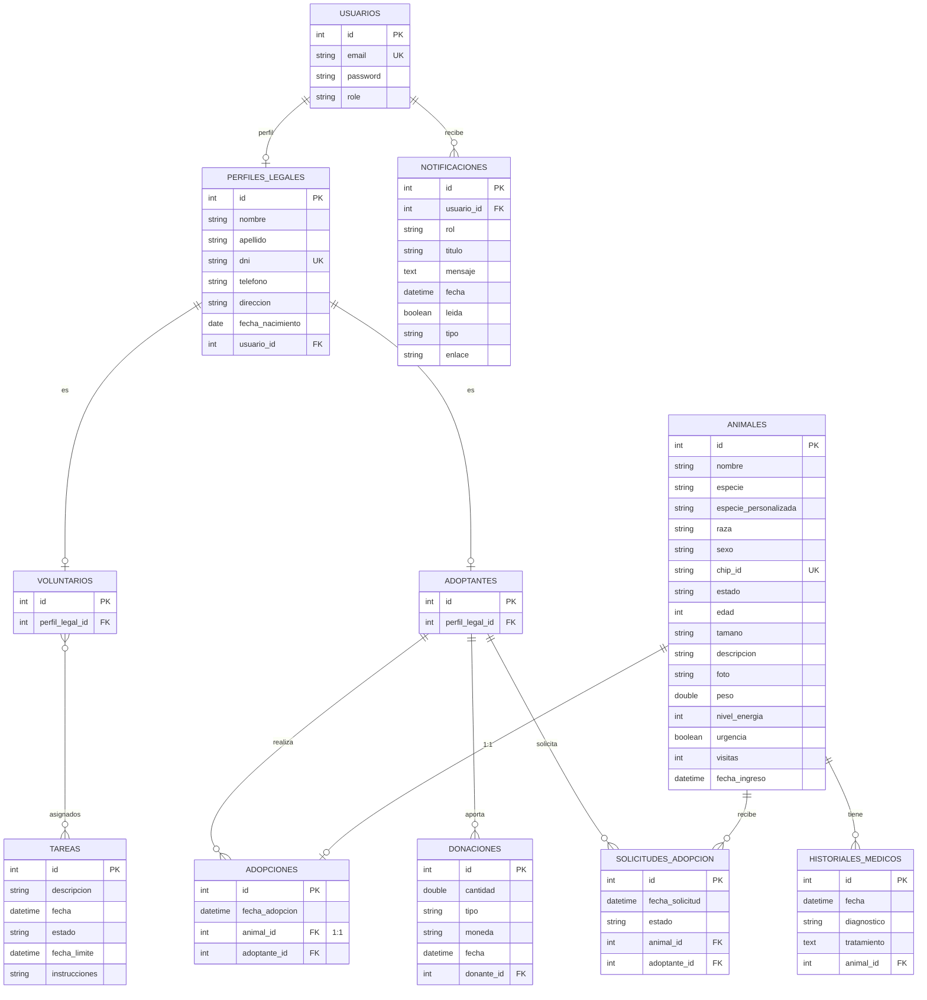

### Base de Datos - Arquitectura y Modelo de Datos
---

La capa de persistencia del **Refugio de Animales** está diseñada para ser robusta, escalable y mantenible. Se utiliza un enfoque basado en **Spring Data JPA** con **Hibernate** como motor de persistencia, gestionando el ciclo de vida de los datos mediante **Liquibase**.

---

#### 1. Infraestructura y Entorno (Docker + MySQL)

A diferencia de prototipos iniciales, el proyecto utiliza **MySQL 8.0** de forma consistente tanto en desarrollo como en producción mediante contenedores Docker. Esto asegura la paridad de entornos.

##### Configuración de Conexión
```properties
# Localización: refugio-backend/src/main/resources/application.properties
spring.datasource.url=jdbc:mysql://localhost:3306/refugio_db
spring.datasource.username=root
spring.datasource.password=root

# Control de Versiones con Liquibase
spring.liquibase.change-log=classpath:db/changelog/db.changelog-master.yaml
```

---

#### 2. Modelo de Datos (Diagrama Entidad-Relación)

El sistema utiliza un esquema relacional normalizado que separa las identidades legales de los usuarios y gestiona flujos complejos de adopción y tareas.



---

#### 3. Gestión de Cambios (Liquibase)

No se utiliza `ddl-auto: update` en producción. En su lugar, todos los cambios de esquema se definen en archivos YAML bajo `src/main/resources/db/changelog/`.

*   **001-initial-schema.yaml**: Creación de tablas base.
*   **002-seed-data.yaml**: Datos maestros (animales, usuarios de prueba).
*   **Changes posteriores**: Añaden columnas (como `peso`, `nivel_energia`) o nuevas tablas (`notificaciones`).

---

#### 4. Estrategia de Almacenamiento de Imágenes

Se ha optado por una estrategia de **Filesystem (Sistema de Archivos)** en lugar de almacenar las imágenes como `BLOB` en la base de datos:

1.  **Rendimiento**: La base de datos se mantiene ligera, acelerando los backups y las consultas.
2.  **Servido Estático**: Las imágenes se sirven directamente por el servidor web/Spring desde la carpeta `uploads/animales/`.
3.  **Referencia en BD**: En la tabla `ANIMALES`, la columna `foto` almacena el nombre del archivo (ej: `luna_e1939c57.jpg`) o la ruta relativa (`/api/v1/animales/images/...`).
4.  **Estandarización**: Los archivos se renombran automáticamente al subir siguiendo el patrón `{nombre}_{uuid}.{ext}` para evitar colisiones.

---

#### 5. Validaciones de Integridad

*   **Chip ID Único**: El `chip_id` es obligatorio y único en la tabla de animales para evitar duplicidad de registros físicos.
*   **DNI Único**: El identificador fiscal en `PERFILES_LEGALES` garantiza que una persona física no se registre varias veces en el sistema.
*   **Identidad de Usuario**: Las columnas `email` y `username` son claves únicas (UK), impidiendo el registro de cuentas duplicadas.
*   **Restricción de Adopción (1:1)**: Un animal solo puede estar asociado a **una** adopción confirmada. El sistema bloquea cualquier intento de duplicar este vínculo.
*   **Integridad Clínica**: Los registros en `HISTORIALES_MEDICOS` requieren obligatoriamente un `animal_id` válido; no se permiten registros médicos sin un paciente asociado.
*   **Validación de Estados**: Las adopciones y solicitudes solo pueden procesarse si el animal se encuentra en estado `DISPONIBLE`. Si el estado cambia a `ADOPTADO` o `RESERVADO`, las solicitudes pendientes quedan bloqueadas.
*   **Asignación de Tareas**: La tabla intermedia `voluntarios_tareas` garantiza la integridad en la asignación de personal, impidiendo que un voluntario sea asignado múltiples veces a la misma tarea específica.
*   **Gestión de Huérfanos (Orphan Removal)**: La eliminación de una entidad principal (como un Animal) desencadena la limpieza automática de sus entidades dependientes (Historiales, Solicitudes) para mantener la base de datos limpia de datos inconsistentes.

---

[Volver](/README.md)
