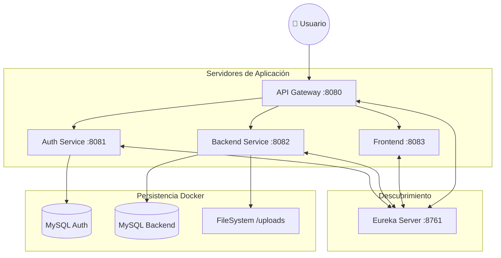

### Despliegue - Infraestructura y Orquestación
---

El sistema del **Refugio de Animales** utiliza una arquitectura de microservicios distribuida, orquestada de forma híbrida entre **Docker** (para servicios de infraestructura) y **Maven/JVM** (para la lógica de negocio).

---

#### 1. Arquitectura de Servicios (Puertos)

La plataforma se divide en varios módulos que se comunican entre sí. El **API Gateway** es el único punto de entrada público.

| Servicio | Puerto | Descripción |
| :--- | :--- | :--- |
| **Eureka Server** | `8761` | Servidor de descubrimiento (Service Registry). |
| **API Gateway** | `8080` | Punto de entrada único y enrutamiento dinámico. |
| **Refugio Auth** | `8081` | Gestión de identidades, roles y JWT. |
| **Refugio Backend** | `8082` | Lógica de negocio, animales, adopciones y tareas. |
| **Refugio Frontend** | `8083` | Interfaz de usuario (Thymeleaf + HTMX). |
| **DB Auth** (Docker) | `3306` | Base de datos MySQL para seguridad y usuarios. |
| **DB Backend** (Docker) | `3307` | Base de datos MySQL para el dominio de negocio. |

---

#### 📦 Módulos de Soporte (Librerías Compartidas)

Además de los servicios ejecutables, el sistema cuenta con un núcleo compartido:

*   **Refugio Common**: No es un servicio ejecutable (sin puerto). Es una librería que provee modelos comunes, excepciones personalizadas, utilidades de seguridad y constantes para asegurar que todos los microservicios mantengan la misma estructura de datos y lógica base.

---

#### 2. Infraestructura de Datos (Docker)

Utilizamos **Docker Compose** para garantizar que los motores de base de datos estén listos y configurados sin necesidad de instalación local.

*   **mysql_refugio_auth**: Persistencia de usuarios y seguridad. Expuesta habitualmente en el puerto `3306`.
*   **mysql_refugio_backend**: Datos maestros de animales, historiales y procesos. Expuesta habitualmente en el puerto `3307` para evitar colisiones.

##### Detalles Técnicos de la Infraestructura
*   **Red de Datos (`refugio-network`)**: Los contenedores operan en una red aislada, permitiendo que solo los microservicios autorizados lleguen a los motores de búsqueda.
*   **Codificación Universal**: Ambos motores están configurados con `--character-set-server=utf8mb4` para soportar descripciones con emojis y caracteres internacionales complejos.
*   **Persistencia Robusta**: Se utilizan volúmenes de Docker para asegurar que los datos sobrevivan a paradas de contenedores (`down`) o actualizaciones de imagen.
*   **Alta Disponibilidad Local**: Configurados con `restart: always`, asegurando que los servicios de datos se levanten automáticamente con el sistema operativo host.

##### Comandos Útiles
```bash
# Levantar bases de datos
docker compose up -d

# Limpiar datos y reiniciar (útil para re-ejecutar semillas de Liquibase)
docker compose down -v && docker compose up -d
```

---

#### 3. Configuración de Entorno (.env)

El sistema depende de un archivo `.env` en la raíz del proyecto para gestionar secretos y configuraciones dinámicas:
*   Credenciales de DB (Root passwords).
*   URLs de conexión entre microservicios.
*   Configuraciones de almacenamiento de archivos.

---

#### 4. Estrategia de Persistencia de Imágenes

Las fotos de los animales no se guardan en la base de datos, sino en el **sistema de archivos** para optimizar el rendimiento:

*   **Ruta Local**: `refugio-backend/uploads/animales/`
*   **Servicio**: El microservicio `refugio-backend` expone estas imágenes bajo el endpoint `/api/v1/animales/images/**`.
*   **Persistencia**: En un entorno de producción real, esta carpeta debe mapearse como un **Volumen de Docker** para evitar la pérdida de fotos al actualizar contenedores.

---

#### 5. Flujo de Comunicación



---

[Volver](/README.md)
