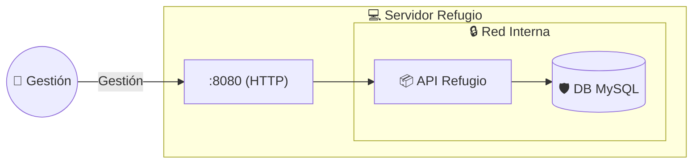

### Despliegue - Infraestructura del Refugio
---

Este apartado detalla la arquitectura de sistemas diseñada para garantizar que la gestión del refugio sea portátil, segura y fácil de desplegar mediante contenedores.

#### Arquitectura de Ejecución (Runtime)
La aplicación utiliza **Spring Boot** con un servidor **Tomcat embebido**, generando un "Fat JAR" que puede ejecutarse en cualquier entorno con una JVM.

#### Estrategia de Contenedorización (Docker)
Se emplea **Docker** para asegurar que el sistema funcione de forma idéntica en el equipo del voluntario o en el servidor del refugio.
* **Imagen Base:** Alpine Linux (mínima superficie de ataque).
* **Aislamiento:** El entorno de ejecución está desacoplado del Sistema Operativo host.

#### Orquestación y Red (Docker Compose)
Se utiliza `docker-compose.yml` para levantar la API y la Base de Datos de forma coordinada:
* **Red Privada:** Los contenedores se comunican internamente.
* **Seguridad:** La base de datos MySQL **no expone puertos al exterior**, siendo accesible únicamente por la aplicación. La API solo expone el puerto **8080**.

#### Estrategia de Persistencia
* **Desarrollo:** Base de datos **H2** (en memoria) para pruebas rápidas.
* **Producción:** **MySQL** para persistencia real y duradera de los datos de animales y adoptantes.

---

[Volver](/README.md)
