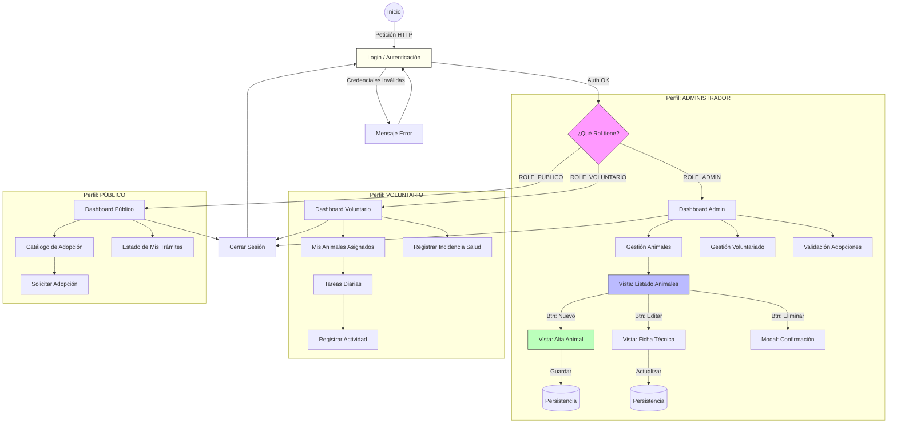

### Diagrama de Navegación - Flujo del Refugio
---

El sistema implementa una segregación de rutas basada en perfiles para optimizar la gestión del refugio.

```mermaid
graph TD
    %% --- ZONA PÚBLICA ---
    Start((Inicio)) -->|Petición HTTP| Login[Login / Autenticación]
    Login -- Credenciales Inválidas --> ErrorLogin[Mensaje Error] --> Login
    
    %% --- ZONA SEGURA ---
    Login -- Auth OK --> Router{¿Qué Rol tiene?}

    %% --- CARRIL ADMINISTRADOR ---
    subgraph "Perfil: ADMINISTRADOR"
        Router -- ROLE_ADMIN --> DashAdmin[Dashboard Admin]
        DashAdmin --> NavAnimal[Gestión Animales]
        NavAnimal --> ViewListAn[Vista: Listado Animales]
        
        %% Operaciones CRUD Animales
        ViewListAn -->|Btn: Nuevo| ViewFormNew[Vista: Alta Animal]
        ViewListAn -->|Btn: Editar| ViewFormEdit[Vista: Ficha Técnica]
        ViewListAn -->|Btn: Eliminar| ModalDel[Modal: Confirmación]
        
        ViewFormNew -- Guardar --> DB_Save[(Persistencia)]
        ViewFormEdit -- Actualizar --> DB_Update[(Persistencia)]
        
        DashAdmin --> NavVolun[Gestión Voluntariado]
        DashAdmin --> NavAdopc[Validación Adopciones]
    end

    %% --- CARRIL VOLUNTARIO ---
    subgraph "Perfil: VOLUNTARIO"
        Router -- ROLE_VOLUNTARIO --> DashVolun[Dashboard Voluntario]
        DashVolun --> MyAnimals[Mis Animales Asignados]
        MyAnimals --> ListTasks[Tareas Diarias]
        ListTasks --> ActionTask[Registrar Actividad]
        DashVolun --> FormIncid[Registrar Incidencia Salud]
    end

    %% --- CARRIL PÚBLICO / ADOPTANTE ---
    subgraph "Perfil: PÚBLICO"
        Router -- ROLE_PUBLICO --> DashPublic[Dashboard Público]
        DashPublic --> Catalog[Catálogo de Adopción]
        Catalog --> ActionRequest[Solicitar Adopción]
        DashPublic --> MyRequests[Estado de Mis Trámites]
    end

    %% --- SALIDA ---
    DashAdmin --> Logout
    DashVolun --> Logout
    DashPublic --> Logout
    Logout[Cerrar Sesión] --> Login

    %% Estilos Visuales
    style Login fill:#ffe,stroke:#333
    style Router fill:#f9f,stroke:#333
    style ViewListAn fill:#bbf,stroke:#333
    style ViewFormNew fill:#bfb,stroke:#333
```

---

[Volver](/README.md)
