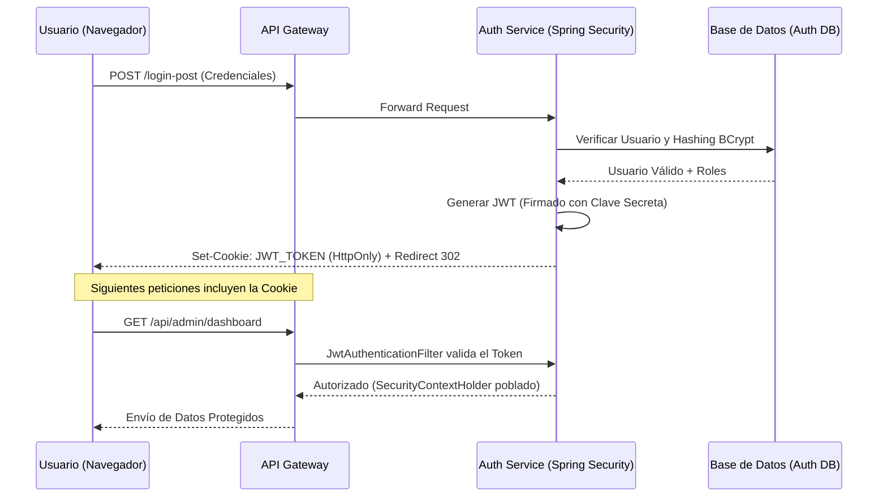

### Estrategia de Seguridad y Control de Acceso - Refugio
---

La seguridad es un pilar crítico en el sistema de gestión del refugio, ya que protege datos sensibles de ciudadanos (adoptantes), voluntarios y el historial legal de los animales. El sistema implementa una arquitectura de seguridad **Stateless** basada en **Spring Security** y **JSON Web Tokens (JWT)**, adaptada para funcionar en un entorno de microservicios distribuido.

---

#### 1. Arquitectura de Seguridad (Auth Service)

El microservicio `refugio-auth` centraliza la gestión de identidad:
*   **Capa de Infraestructura:** Implementa el `SecurityFilterChain` de Spring Security, configurando la política de acceso a cada endpoint de forma centralizada.
*   **JWT en Cookies (HttpOnly):** Para mitigar ataques de Cross-Site Scripting (XSS), el token JWT no se almacena en el `localStorage` del navegador, sino en una **Cookie cifrada con el flag `HttpOnly`**. Esto impide que scripts maliciosos accedan al token desde el lado del cliente.
*   **Cifrado de Contraseñas:** Se utiliza **BCrypt** con un factor de trabajo robusto para el hashing de contraseñas, garantizando que nunca se almacenen en texto plano en la base de datos.

---

#### 2. Modelo de Roles y Permisos (RBAC)

Se ha implementado un sistema de **Control de Acceso Basado en Roles (RBAC)** que adapta la interfaz y las capacidades del sistema según el perfil del usuario:

| Rol | Descripción | Permisos Clave |
| :--- | :--- | :--- |
| **VISITANTE** | Público anónimo (sin cuenta) | Lectura del catálogo público, registro de cuenta y login. |
| **ADOPTANTE** | Ciudadano registrado | Enviar solicitudes de adopción, realizar donaciones y gestionar perfil. |
| **VOLUNTARIO** | Personal operativo del refugio | Gestión de tareas diarias, cuidados y actualización de historiales médicos. |
| **ADMIN** | Gestión estratégica y legal | Control total de usuarios, validación de solicitudes, contratos y estadísticas. |
| **DUAL** | Voluntario y Adoptante | Perfil especial para miembros del staff que también colaboran como adoptantes. |

---

#### 3. Integración con API Gateway y Redirecciones

Dado que el sistema corre tras un **API Gateway**, se han implementado mecanismos para asegurar la transparencia en las comunicaciones:
*   **Gateway Awareness:** El sistema utiliza los headers `X-Forwarded-Host` y `X-Forwarded-Proto` inyectados por el Gateway. Esto asegura que tras un login exitoso, Spring Security redirija al usuario a la URL pública (ej: `https://localhost:8443`) y no a la IP interna del microservicio.
*   **Seguridad de Red:** La base de datos y los microservicios internos residen en una red privada de Docker, siendo el Gateway el único punto de entrada expuesto al exterior.

---

#### 4. Flujo de Autenticación y Autorización

---

#### 5. Protección contra Amenazas y Buenas Prácticas

*   **CSRF (Cross-Site Request Forgery):** Protegido automáticamente por Spring Security en los formularios que utilizan Thymeleaf.
*   **XSS (Cross-Site Scripting):** Mitigado mediante el uso de cookies `HttpOnly` y el escape automático de caracteres en el motor de plantillas.
*   **Prevención de Inyección SQL:** Garantizada mediante el uso de **Spring Data JPA** y el uso de repositorios que parametrizan todas las consultas a la base de datos.
*   **Gestión de Sesiones:** Al ser una arquitectura **Stateless**, el servidor no mantiene estado de sesión, lo que facilita el escalado horizontal de los servicios.

---

[Volver al Índice de Documentación](/README.md)
