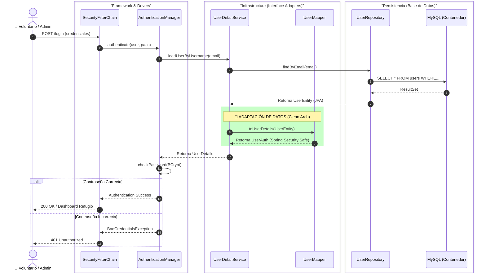

### Seguridad Integral - Gestión del Refugio
---

#### Diseño de Seguridad y Arquitectura de Autenticación

La seguridad del **Refugio de Animales** se implementa utilizando **Spring Security** como capa de protección transversal, integrada dentro de la **Arquitectura Clean** mediante el patrón de *Vertical Slicing*.

##### 1. Integración en Arquitectura Clean
La seguridad se trata como una responsabilidad de la capa de **Infraestructura**. El Dominio de animales y adopciones permanece agnóstico a Spring Security.

* **Vertical Slice:** Se ha definido un slice `auth` (`com.refugio.auth`) que encapsula la identidad corporativa y del voluntariado.
* **Separación de Responsabilidades:**
    * **Dominio:** Define `Usuario`, `Roles` y `Permisos` (ej. `ANIMAL_CREATE`, `ADOPTION_UPDATE`).
    * **Aplicación:** Interfaces para la gestión de usuarios del refugio.
    * **Infraestructura:** Configuración del `SecurityFilterChain` y `UserDetails`.

##### 2. Modelo de Dominio de Seguridad (RBAC)
Se ha diseñado un sistema de permisos granulares agrupados en roles adaptados a la operativa del centro:

1.  **Enum `Permiso`:** 
    * `ANIMAL_READ`, `ANIMAL_WRITE` (Gestión de fichas).
    * `VOLUNTEER_READ`, `VOLUNTEER_WRITE` (Gestión de personal).
    * `ADOPTION_READ`, `ADOPTION_WRITE` (Gestión de procesos).
2.  **Enum `Rol`:**
    * `ROLE_PUBLICO`: Lectura del catálogo de animales y solicitud de adopción.
    * `ROLE_VOLUNTARIO`: Gestión diaria de animales y tareas de cuidado.
    * `ROLE_ADMIN`: Control total (Gestión de usuarios, auditoría de adopciones).

##### 3. Flujo de Autenticación (Spring Security Flow)
El proceso de login sigue el flujo estándar adaptado a nuestra persistencia JPA, asegurando que cada voluntario o administrador acceda solo a sus funciones asignadas.

##### 4. Configuración de Seguridad
* **Rutas Públicas:** `/`, `/animales/catalogo`, `/login`, `/css/**`, `/js/**`.
* **Protección por Rol:**
    * `/admin/**` → Requiere `ROLE_ADMIN`.
    * `/voluntarios/**` → Accesible para `ROLE_ADMIN` y `ROLE_VOLUNTARIO`.
    * `/adopciones/**` → Escritura permitida para `ROLE_ADMIN`, lectura para otros roles.

---

#### Seguridad de Infraestructura y Red

Siguiendo el principio de **Defensa en Profundidad**, la base de datos del refugio reside en una subred privada de Docker, aislada de accesos externos directos. Solo el backend de la aplicación tiene visibilidad sobre el contenedor `db`.

---

[Volver](/README.md)
